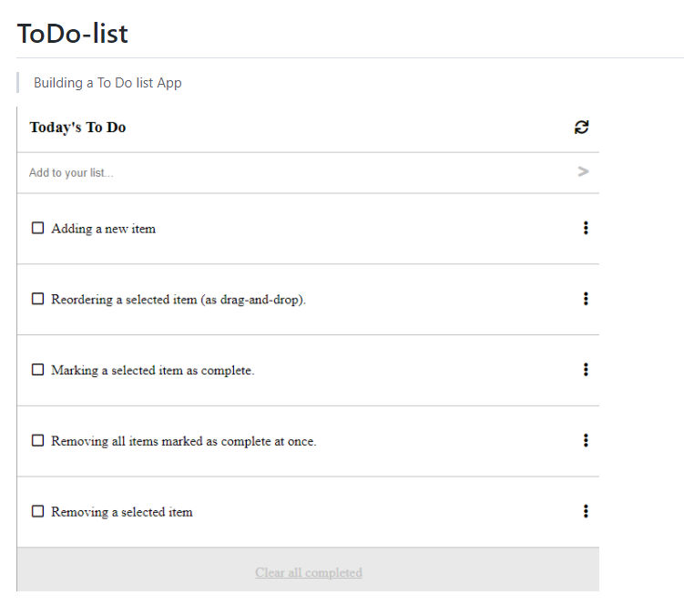

# ToDo-list

Building a To Do list App

## Built With

- HTML
- CSS
- JavaScript
  -Webpack

## Live DEMO

( https://vabuyia.github.io/To-do-list/)

## Getting Started

To get a local copy up and running follow these simple example steps.

Clone the repo with git clone git@github.com:vabuyia/To-do-list

Run npm install from the command line

Run npx hint . to test for html linting check

Run npx stylelint "\*_/_.{css,scss}" to test for css linting check

The app is deployed using GitHub pages. You can view it using the 'live demo' above.

## Authors

👤 **Vincent Abuya **

- GitHub: [@vabuyia](https://github.com/vabuyia)
- Twitter: [@abuyiag](https://twitter.com/abuyiag)
- LinkedIn: [LinkedIn](https://linkedin.com/in/vincent-abuya)

## 🤝 Contributing

Contributions, issues, and feature requests are welcome!

Feel free to check the [issues page](../../issues/)

## Show your support

Give a ⭐️ if you like this project!

## Acknowledgments

- Hat tip to our code reviewers on Microverse

## 📝 License

This project is [MIT](./MIT.md) licensed.
